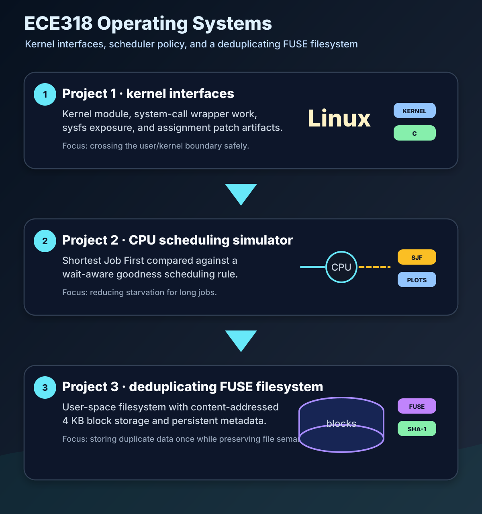
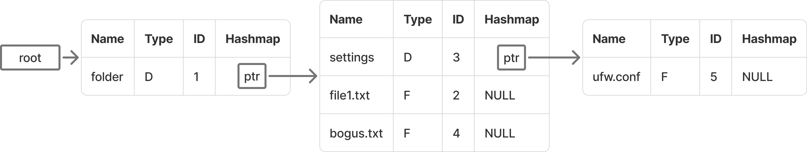
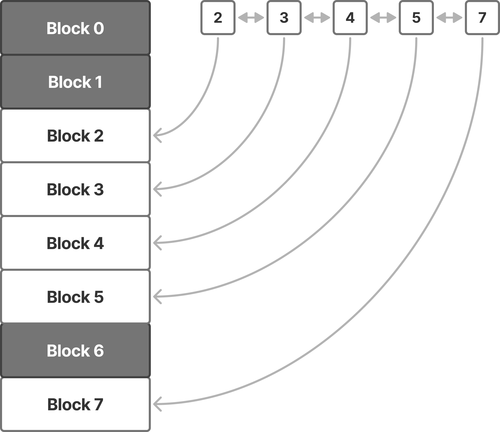
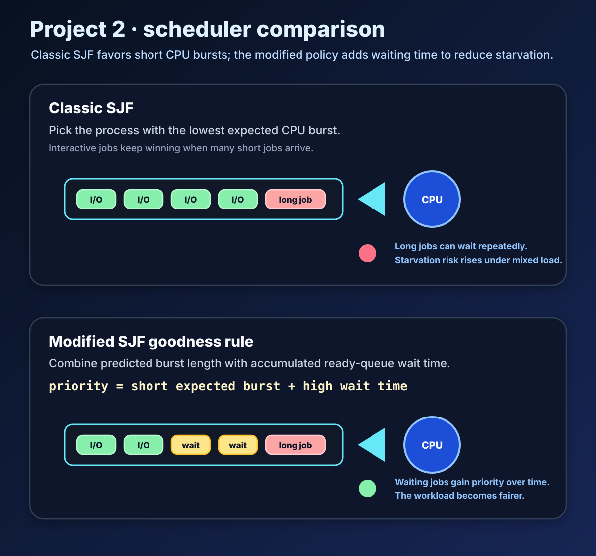
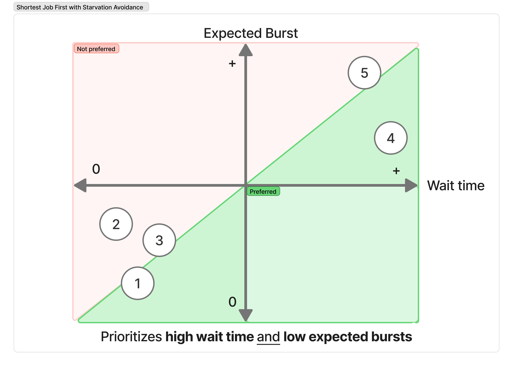
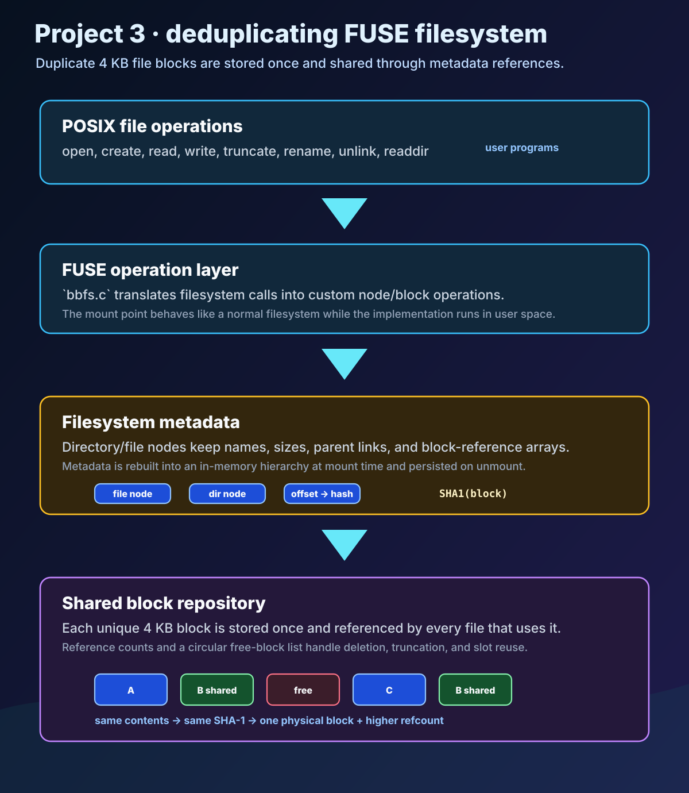

# ECE318 — Operating Systems


Coursework repository for **ECE318 — Operating Systems** at the **University of Thessaly**. The projects move from Linux kernel interfaces and system-call experiments to CPU scheduling simulation and finally to a FUSE filesystem with persistent block storage.

<p align="center">
  
</p>

## Standout work: deduplicating FUSE filesystem

The highlight of this repository is **Project 3**, a FUSE filesystem that stores duplicate 4 KB file blocks only once instead of writing repeated data multiple times. The implementation goes beyond the simplified version suggested by the handout: instead of relying on the easier shortcuts, it keeps full filesystem behavior working with custom metadata, block lookup, node tracking, persistence, and test coverage.

<p align="center">
  
</p>

Key pieces of the Project 3 implementation include:

- **Content-addressed block storage:** file data is split into 4 KB blocks, hashed with SHA-1, and stored in a shared block repository so repeated blocks can be referenced instead of duplicated.
- **Reference-counted block lifetime:** metadata tracks how many files refer to each stored block so deletion and truncation can reclaim data safely.
- **Free-space management and partial defragmentation:** unused repository slots are tracked through a circular free-block list, with partial defragmentation used to reduce external fragmentation.
- **Persistent node hierarchy:** directories and files are represented through custom node metadata that is rebuilt into an in-memory hierarchy at mount time and written back on unmount.
- **Full FUSE operation path:** file creation, deletion, reads, writes, truncation, directory operations, and rename behavior are handled in the filesystem layer.
- **Automated and end-to-end testing:** Python `unittest` cases cover block reuse, compression behavior, truncation semantics, defragmentation, and nested file/directory hierarchies; the filesystem was also pushed beyond small synthetic tests by running a Minecraft server on top of it, until multithreaded world generation became the limiting factor.

<p align="center">
  
</p>

## Course contents

| Path | Description |
| --- | --- |
| [`Project1/`](Project1/) | Linux kernel module and system-call work. |
| [`Project1/project1_find_roots/`](Project1/project1_find_roots/) | User-space wrapper and test files for the `find_roots` system-call work. |
| [`Project1/project1_module/`](Project1/project1_module/) | Kyber/elevator kernel module changes and build files. |
| [`Project1/sysfs_module/`](Project1/sysfs_module/) | sysfs kernel module implementation. |
| [`Project2/`](Project2/) | CPU scheduling simulator, workload configs, plotting scripts, and report. |
| [`Project2/Scheduler_VM/`](Project2/Scheduler_VM/) | Scheduler VM implementation with SJF and modified goodness-based scheduling behavior. |
| [`Project3/`](Project3/) | FUSE filesystem project, development tree, final packaged source layout, experiments, and report. |
| [`Project3/final/filesystem/`](Project3/final/filesystem/) | Final Project 3 filesystem source and Makefile. |
| [`Project3/final/experiments/`](Project3/final/experiments/) | Python unittest workflow for Project 3 filesystem behavior. |
| [`Project3/final/report/`](Project3/final/report/) | Final Project 3 report; collected copy under [`docs/reports/`](docs/reports/). |
| [`docs/images/`](docs/images/) | Selected report graphics used by this README. |

## Project details

### Project 1 — kernel interfaces

Project 1 contains Linux kernel-facing work: module builds, syscall-side experiments, sysfs exposure, and the final patch artifact used for the kernel changes. The project is organized into separate folders for each component so the module and user-space pieces can be inspected independently.

### Project 2 — CPU scheduling

Project 2 implements and evaluates scheduling behavior in a simulator. The `Scheduler_VM` tree includes workload configuration files, scheduler source code, scripts for running experiments, plotting support, and the final report at [`docs/reports/project-2-cpu-scheduling.pdf`](docs/reports/project-2-cpu-scheduling.pdf).

The main comparison is between classic **Shortest Job First** and a modified SJF policy that combines expected CPU burst time with time spent waiting in the ready queue. Plain SJF can starve long/non-interactive jobs when many interactive jobs keep arriving; the modified goodness score trades some scheduler overhead for fairer CPU distribution.

<p align="center">
  
</p>

<p align="center">
  
</p>

The included experiment configurations cover mixed and single-class workloads:

- 1 non-interactive + 25 interactive processes
- 5 non-interactive + 5 interactive processes
- 4 non-interactive processes
- 4 interactive processes

The plotting workflow generates Gantt charts, expected-burst traces, CPU-usage views, and goodness-score traces for comparing the two policies.

### Project 3 — FUSE filesystem

Project 3 is the largest implementation in the repository. The final report is available at [`docs/reports/project-3-deduplicating-fuse-filesystem.pdf`](docs/reports/project-3-deduplicating-fuse-filesystem.pdf).

The final source layout is under:

```text
Project3/final/
```

The final filesystem source is in:

```text
Project3/final/filesystem/
```

The tests and experiment workflow are in:

```text
Project3/final/experiments/
```

<p align="center">
  
</p>

The older `fuse-compressed-fs/` and `fuse-tutorial-2018-02-04/` trees show the development path from the base FUSE tutorial code toward the final filesystem implementation.

## Requirements

General tools:

- Linux environment
- `gcc`
- `make`
- Python 3

Project 3 additionally needs FUSE and OpenSSL development headers:

```bash
sudo apt update
sudo apt install pkg-config libssl-dev libfuse-dev
```

Project 1 targets Linux kernel/module workflows, so it should be built in an environment with the appropriate kernel headers/source setup for the assignment.

## Quick validation

Build the Project 2 scheduler simulator:

```bash
cd Project2/Scheduler_VM/src
make
```

Build the Project 3 filesystem after installing the FUSE/OpenSSL development headers listed above:

```bash
cd Project3/final/filesystem
make
```

Run the Project 3 functional tests after building `bbfs`:

```bash
cd Project3/final/experiments
mkdir -p ./fs/mountdir ./fs/rootdir
python3 -m unittest test
```

## Full setup explanation

### Project 2 scheduler simulator

From the repository root:

```bash
cd Project2/Scheduler_VM/src
make
```

Run one of the included workload configurations:

```bash
./sjf_sched ../confs/simple.conf
```

The project also includes additional configurations under:

```text
Project2/Scheduler_VM/confs/
```

and plotting/experiment helpers under:

```text
Project2/Scheduler_VM/run.sh
Project2/Scheduler_VM/plot.py
```

### Project 3 filesystem

Install dependencies first:

```bash
sudo apt update
sudo apt install pkg-config libssl-dev libfuse-dev
```

Build the filesystem:

```bash
cd Project3/final/filesystem
make clean
make
```

Create the root and mount directories:

```bash
mkdir -p rootdir mountdir
```

Run the filesystem:

```bash
./bbfs ./rootdir ./mountdir
```

Unmount it when finished:

```bash
fusermount -u ./mountdir
```

Run the experiment tests:

```bash
cd ../experiments
mkdir -p ./fs/mountdir ./fs/rootdir
python3 -m unittest test
```

### Project 1 kernel work

Project 1 contains source and patch artifacts for kernel-facing assignment components. Inspect the relevant folder for each part:

```text
Project1/project1_find_roots/
Project1/project1_module/
Project1/sysfs_module/
```

Build commands depend on the kernel/module environment used for the assignment, but the source layout keeps each component separate for easier inspection and reuse.
